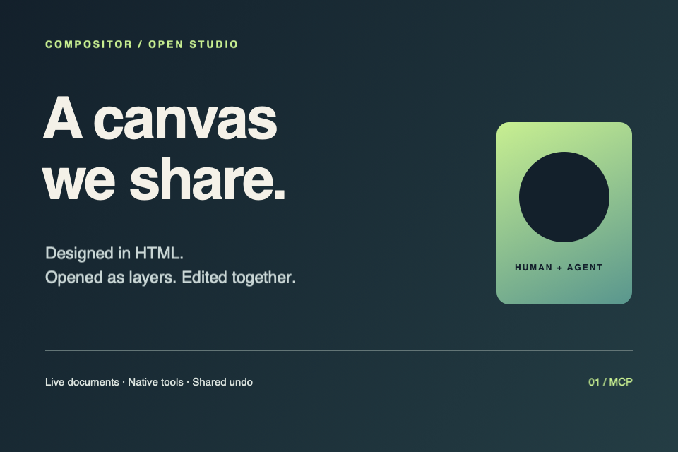

# Compositor agent connection

The MCP server runs **inside Compositor** and edits the same tabs, layers, selections and history as the person using the app. It speaks standard MCP over a loopback HTTP endpoint, so Claude Code, Codex, Cursor and any other streamable-HTTP client connect directly — there is no external runtime or bridge process.

## Connect

1. Build and open this version of Compositor.
2. In **Compositor → Agent Connection**, enable **MCP**.
3. Choose **Copy MCP Configuration** and add the copied entry to your client's MCP configuration. The endpoint URL contains the access token, so the copied configuration keeps working across app relaunches.

```sh
# Claude Code
claude mcp add --transport http compositor http://127.0.0.1:27892/mcp/<token>
# Codex
codex mcp add compositor --url http://127.0.0.1:27892/mcp/<token>
```

Cursor reads the same URL from `~/.cursor/mcp.json`:

```json
{ "mcpServers": { "compositor": { "url": "http://127.0.0.1:27892/mcp/<token>" } } }
```

The menu shows connection status. Turning the connection off closes clients and rotates the access token, so previously copied configurations stop working until copied again. Edits already committed remain in native undo history. Keep the app open while using its tools.

## Collaboration

List documents first. Keep the returned `document_id` and pass it on subsequent calls, rather than relying on whichever tab is selected. Read the current document before modifying it. Mutation tools accept an `expected_revision` so stale edits can be rejected. Agent calls also reject active human editing operations; finish or cancel the gesture/dialog and retry.

Entity ids (documents, layers and guides) are the shortest unique prefix of the underlying UUID — at least eight characters — and any longer prefix or full UUID is accepted back. Mutation tools answer with a **delta** in `describe_document` vocabulary: `changed` names the top-level sections whose values moved, those sections carry their new values, `layers` holds the resulting state of created or edited layers with their top-to-bottom `index`, and `removed_layer_ids` lists deletions. Patch your model from the delta instead of re-reading the document; `layers_note` appears when more than 20 layers changed at once. `new_document_ids` and `closed_document_ids` report tab lifecycle at the top level.

Edits use the app's native undo history. Tools report validation and execution failures with `isError`; protocol errors use JSON-RPC errors. A transport disconnect is not proof that a mutation failed: read state before retrying. `notifications/cancelled` interrupts an in-flight call at its next checkpoint; committed edits stay undoable.

## Skills

Skills are markdown editing recipes stored in `~/.compositor/skills/<id>/SKILL.md`. `initialize` lists installed skills in the server instructions so a matching recipe is found before one is improvised; `read_skill` loads one in full, and `manage_skills` lists, creates, updates and removes them. A skill is a `name` (80 characters) and `description` (1024 characters) frontmatter followed by workflow prose: it suggests tool calls but cannot execute anything by itself.

Three complete [example skills](examples/skills) ship with this document — `skin-retouch`, `product-composite` and `film-look`. Copy their folders into `~/.compositor/skills/`, or have the agent install one with `manage_skills` `action: "create"`.

## HTML/CSS designs

`import_html` accepts `html`, optional `css`, `width`, `height`, and an optional `name`. It creates a new visible tab without replacing the current document. Supply self-contained markup with data URLs for images and fonts. Author JavaScript, external network requests and local file URLs are disabled.

Simple layout elements become editable native layers. Browser effects that have no faithful native equivalent use raster layers; the result reports conversion warnings. Do not assume every CSS property can become a native Compositor property. The original markup is available through `compositor://html/{document_id}` for the current app session; save source separately for later HTML re-imports.

Canvas coordinates are pixels with the origin at the upper left. Current HTML imports are limited to 4096 pixels per side, 16 million canvas pixels, 2000 DOM elements, and bounded source/layer budgets.

A complete [960 × 640 example](examples/agent-layout.html) imports as 11 layers. Pass the file contents as `html`, with `width: 960` and `height: 640`.



## Files and the sandbox

Compositor keeps its macOS sandbox, so the tools move image and project **bytes** and the agent does the filesystem work with its own file access:

- **Import an image or PSD**: read the file, base64-encode it, and pass it to `import_image` with a `filename` carrying a supported extension (`.png`, `.jpg`, `.jpeg`, `.heic`, `.tif`, `.tiff`, `.psd`).
- **Export the finished image**: `render_document` returns base64 PNG at full canvas resolution; decode and write it wherever the deliverable belongs.
- **Save an editable project**: `read_project_data` returns a base64 envelope which, decoded, is `{"format": "com.compositor.mcp-project", "manifest": <base64 manifest.json>, "images": {"<uuid>[.mask].png": <base64>, …}}`. Write the decoded `manifest.json` and an `images/` directory beside it inside a directory named `<name>.comp`, and the native loader opens that package like any Compositor project.
- **Reopen a project**: read a `.comp` package's `manifest.json` and `images/`, rebuild that envelope, and pass it to `open_project_data`. The project opens in a new tab.

Images and self-contained project envelopes are limited to 24 MiB each; a manifest is limited to 4 MiB. Large production projects can still be edited in the GUI, but may exceed the current MCP transfer budget. Render previews default to a 1600-pixel longest edge; request `max_dimension: 0` for full resolution.

## Transport and security

The application retains its macOS sandbox. The HTTP endpoint binds only to `127.0.0.1` (a well-known port by default, with an ephemeral fallback when it is taken). The URL path carries the access token, which is stored in an owner-only application-support file so client configuration survives relaunches; turning the connection off removes the file and rotates the token.

Because a local HTTP endpoint is reachable from any web page that guesses its URL, every request is checked before its body is interpreted: `Origin` and `Host` must name loopback, the path must carry the current token, and an unknown `Mcp-Session-Id` is refused. Bodies are bounded at 40 MiB and parsed strictly; there are no automatic mutation retries. Each request is answered on its own connection and closed. Requests without a session id work statelessly, and `DELETE` tears a session down.

## Reuse

The JSON-RPC error conventions were adapted from Marcus Horndt's MIT-licensed [compositor-mcp](https://github.com/marcushorndt/compositor-mcp), revision `cf2bf8c`. Its license is retained in `docs/licenses/compositor-mcp-MIT.txt` and bundled with the app as `compositor-mcp-LICENSE.txt`. The standalone server's snapshot store and headless editing handlers were not adopted: the integrated server uses this application's `ProjectWorkspace` and `EditorSession`, avoiding a second document model. Optional external image-generation services are not required.

## Build and test

Requirements: macOS 26.5 or later and Xcode with the macOS 26.5 SDK or later.

```sh
./scripts/build-mcp.sh
./scripts/build-mcp.sh --install
# Optional second argument chooses a different app destination.
xcodebuild -project Compositor.xcodeproj -scheme Compositor \
  -configuration Debug -derivedDataPath build \
  CODE_SIGN_IDENTITY=- DEVELOPMENT_TEAM= \
  -parallel-testing-enabled NO -test-timeouts-enabled YES \
  -default-test-execution-time-allowance 60 \
  -maximum-test-execution-time-allowance 120 -only-testing:CompositorTests test
```

The install command creates `~/Applications/Compositor MCP.app` and refuses to overwrite an existing application. Open it, then enable the connection in the menu. This is a locally signed development build, not a notarized release. The local build script keeps the app sandbox and disables hardened-runtime library validation because ad-hoc signing has no team identity matching the bundled Sparkle framework. Signed distribution should use an Apple development team and the project’s hardened Release settings.

The transport tests in `CompositorTests/MCPTransportTests.swift` run the real HTTP endpoint on an ephemeral port and cover the handshake, tool calls, batching, cancellation and every rejection path.

## Tool coverage

The server advertises 30 tools. Each tool has a JSON schema; `get_capabilities` returns the app's enum values and complete default models for adjustments, effects and filters. Use those values instead of guessing parameter names.

| Area | Tools |
| --- | --- |
| Discovery and state | `get_capabilities`, `list_documents`, `describe_document`, `get_editor_state` |
| Documents and project data | `new_document`, `close_document`, `read_project_data`, `open_project_data` |
| Import and export | `import_html`, `import_image`, `render_document` |
| Compositing | `layer_operation`, `transform_operation`, `mask_operation`, `adjustment_operation`, `effect_operation` |
| Drawing and pixels | `text_operation`, `shape_operation`, `paint_stroke`, `gradient_operation`, `pixel_operation`, `filter_operation` |
| Canvas and selection | `canvas_operation`, `guide_operation`, `selection_operation`, `sample_selection` |
| Collaboration | `history_operation`, `settings_operation` |
| Skills | `read_skill`, `manage_skills` |

`read_project_data` exposes the entire native editable project, including original layer and mask pixels, text, shapes, effects, adjustments, guide and canvas metadata. `open_project_data` validates and imports that format into a new tab.

## Examples

Import an editable layout into a new tab:

```json
{
  "name": "import_html",
  "arguments": {
    "name": "Launch card",
    "width": 1200,
    "height": 800,
    "html": "<main><h1>Make room for ideas.</h1><p>A shared canvas.</p></main>",
    "css": "body{margin:0;background:#162730;color:#f5f1e6;font-family:Arial}main{padding:80px}h1{font-size:80px}p{font-size:28px}"
  }
}
```

Use the returned `document_id` with `describe_document`, then use layer IDs to update text, move layers or add effects. Revision values cover the workspace; refresh state after a human edit or a tab switch.

Create a selection-based mask:

1. `selection_operation` with `action: "ellipse"` and its canvas bounds.
2. `mask_operation` with `action: "add"`, the target `layer_id`, `from_selection: true`, and `revealing: false`.
3. The native mask command creates a black mask with white inside the selection and consumes the selection in one undo step. `revealing: true` reverses those mask values.
4. `paint_stroke` with `target: "mask"` can refine it; white reveals and black hides. Use `target: "layer"` to resume painting image pixels.

The HTML importer prioritizes faithful appearance. Supported flat text/shapes remain editable; gradients and embedded assets use isolated raster layers. Unsupported stacking, shadows and transforms may flatten the entire design, with a warning. HTML source is session-only and is not stored in `.comp` projects. Keep the original source alongside the project when future re-import is needed.

Layered Photoshop imports use `import_image` with a `.psd` filename and base64 data. The native reader supports 8-bit RGB PSD files, including its supported layer, group, mask and adjustment types. Conversion notes are returned in the tool result: Photoshop text, smart objects and unsupported layer types may become pixels, and unsupported effects may be discarded. Compositor does not write PSD files; preserve the editable result as `.comp`.

For an independent mask transform, first use `mask_operation` with `action: "set_linked"` and `linked: false`, then `transform_operation` with `target: "mask"`. `link`/`unlink` instead create or remove a clipping relationship to another source layer. Delete calls reject a source that still has clipping dependents; unlink those dependents first. Filter and transform tools default to the layer target and support an explicit mask target, so a previous human mask selection cannot redirect their edits.
